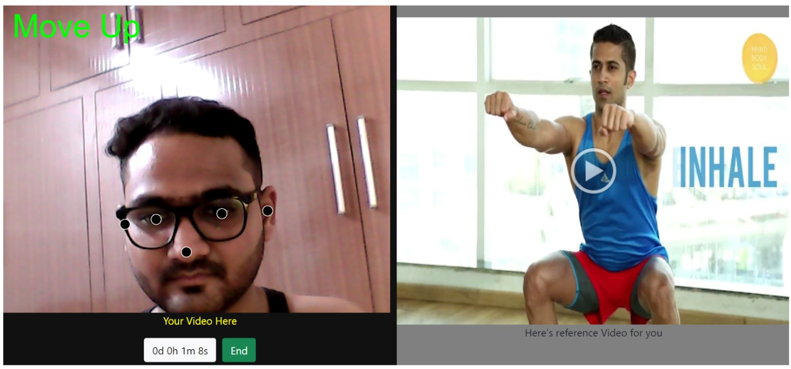

<h1><i><a href="https://my-yogi-lite.herokuapp.com/">Click to visit the webapp<i></a></h1>
  
<h2>Introduction</h2>

In this era of hectic and stressed life, we are here to present you a virtual fitness instructor which will help in exercise and yoga by providing correct poses. It goes without saying that yoga should be an ego-free playground. Practitioners should always feel free to come and move and flow according to their own unique needs and body types. However, this isn’t always the case.   
My idea is to provide everyone their personal fitness guide which will help them in living a healthy life without making any extra efforts. It will help in learning and performing correct exercises and yoga effortlessly.   
Apart from this, it has many additional features. It will remind us to maintain regularity and will have a complete record of daily progress which will help in motivation. With the help of a calorie counter, it will tell us how many calories we burnt during our exercise period.

  

<h1><i>Tour of the project</i></h1>

<h2>Landing Page</h2>
<table style="width:100%">
  <tr>
    <th></th>
  </tr>
 </table>
 
 <h2>Google authentication</h2>

<table style="width:100%">
  <tr>
    <th></th>
  </tr>
 </table>
 
 <h2>Exercises Available</h2>
 
 <table style="width:100%">
  <tr>
    <th></th>
  </tr>
 </table>

<h2>ML to detect user frame</h2>

<table style="width:100%">
  <tr>
    <th></th>
  </tr>
 </table>
 

